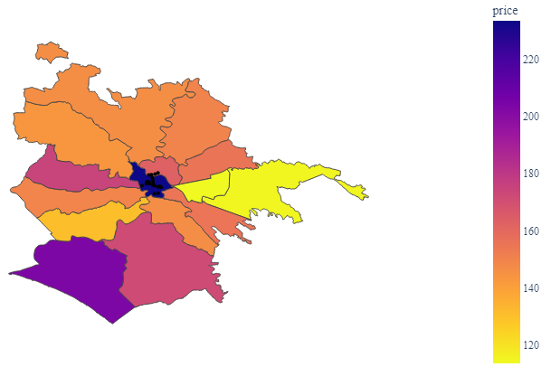

# Airbnb rental price prediction across European cities

By Mahak Aggarwal
mahakagg@utexas.edu
The University of Texas at Austin

## Abstract
This paper studies the different factors that influence the price of Airbnb listings. Combining datasets from multiple cities, an initial data analysis is performed, followed by feature engineering to prepare the dataset for regression. Regression using two methods is performed (XGBoost and neural network) to create a model that can predict listing prices, given certain features. Finally, the results are analyzed to determine the highest common influencers of the listing prices.

## Introduction
Airbnb is an American company managing an online marketplace where users can rent out their properties for short-term rentals to other users who want alternatives to common tourist rentals such as hotels ("Airbnb”, 2024a). With the recent gain in popularity of the shared economy, Airbnb reached a market capitalization of 87.26 billion USD (or 83.12 billion EUR) ("Market capitalization of Airbnb”, n.d.) which makes the rental pricing an important aspect of the business, the hosts, as well as the guests. Understanding the factors that influence the price can result in accurate predictions that can help hosts increase their earnings as well as keep the pricing reasonable for guests. In this paper, data from some of the most visited cities (Chhetri, 2024a) in the European Union is analyzed to understand the common pricing factors. The cities chosen are Athens (Greece), Berlin (Germany), Madrid (Spain), Paris (France), Rome (Italy), and Vienna (Austria). Results from two regression methods, XGBoost and neural networks, are analyzed to understand the factors that influence the price of Airbnb listings.

## Related Work
Due to the increase in the popularity of shared housing, there has been an increase in research on the price prediction of Airbnb rentals in many countries. Many studies have explored the impact of factors such as city, location, host features, property features, regulations, crime, environmental impact, and impact on the economy.

## Data
For the rental price prediction task, this paper combines the publicly accessible Airbnb listings data for the 6 European cities, available at Inside Airbnb (n.d.). While the dataset combines the data for each city for the last 12 months, the data for Berlin covers only 9 months. This resulted in 733,578 entries with 74 features detailing information about the properties, the hosts, pricing, reviews, and availability. The entries missing the rental price, which made up 19.9% of the dataset, were removed, resulting in a final count of 587,516 entries.

### Exploratory Data Analysis
Exploratory data analysis (EDA) is the process of analyzing data to detect patterns, anomalies, and outliers, check assumptions, and gather insights from it before preparing the data for machine learning tasks (Patil, 2018). Analysis of important variables affecting the rental price provided some important insights.

|  | 
|:--:| 
| *Figure 1: Distribution of cities in the dataset* |

Figure 1 represents the frequency of listings in the dataset. The frequency for Berlin is low as data from the last quarter wasn’t available. As for Paris, Rome, and Madrid, these results are similar to the ones found by Adamiak (2018) and consistent with the fact that these cities are some of the most visited in the world (Chhetri, 2024b).

|   | 
|:--:| 
| *Figure 2: Average, median, and maximum prices by city (in order: Athens, Berlin, Madrid, Paris, Rome, and Vienna)* |

The figure 2 shows the average, median, and maximum rental prices per city. It indicates that Paris is the most expensive city whereas Athens is the least expensive (except for some outliers).

|  | 
|:--:| 
| *Figure 3: Correlation heatmap* |

The following table (1) shows the meaning of some of the important features of the dataset ("Inside Airbnb”, n.d.). The entire data dictionary can be found at "Inside Airbnb” (n.d.). This table can help understand the correlation heatmap, as shown in Figure 3, which shows the relationship between different features. Highly correlated features are dark red, whereas features that are negatively correlated are blue. Some obvious relations are that of reviews. The number of reviews, reviews in the last few days, and reviews of different categories such as cleanliness, communication, location, and value are highly positively correlated. Some of the hosts’ features such as response rate, response time, and acceptance rate are correlated as well. Features such as latitude, room type, accommodates, beds, bathrooms, and city are positively correlated with price. Identical results were obtained by Akalın and Alptekin (2024) which showed that the number of guests accommodated, the number of bathrooms, and the type of room were positively correlated with price. Surprisingly, distance to closest attraction, and review scores are negatively correlated with price.

| **Feature** | **Description** |
|---|---|
| source | Source of the listing. Whether this was found by searching the city or was part of a previous scrape. |
| host_acceptance_rate | The rate at which the host accepts the booking. |
| host_is_superhost | Whether the host is a superhost or not. According to the Airbnb help center ("Understand the Superhost program", n.d.), "A Superhost is a host who goes above and beyond to provide excellent hospitality." |
| room_type | One of four values: Entire home/apt, Private room, Shared room, and Hotel. |
| accommodates | Maximum occupancy capacity. |
| bathrooms_text | Number of bathrooms available. |
| beds | Number of beds available. |
| price | Daily price (in EUR). |
| number_of_reviews_ltm | The number of reviews the listing has (in the last 12 months) |

|  | 
|:--:| 
| *Figure 4: Distribution of prices by room type* |

|  | 
|:--:| 
| *Figure 5: Distribution of room types* |

The box plot (Figure 4) provides important insights into the relationship between room type and price. It shows that entire homes/apartments and private rooms have higher prices compared to shared rooms and hotel rooms. The frequency histogram (Figure 5) shows that entire homes/apartments being rented out are common in all the cities.

Choropleth maps were created to show the average distribution or prices by neighborhoods in each of the cities (Figures 6, 7, and 8). Google Places API ("Places API”, n.d.) was used to collect information about the top 20 prominent tourist attractions in each city.

|   | 
|:--:| 
| *Figure 6: Average price by neighborhoods of Athens and Berlin. The black dots indicate prominent tourist attractions.* |

The map of Athens (figure 6) indicates that most of the average-priced rentals are around the center of the city where the majority of the tourist spots can be found. The prices of neighborhoods far from the center have lower prices.

In Berlin (Figure 6), the district of Mitte ("Mitte”, 2024) located in the central part of the city (which has the most concentration of tourist attractions) has higher average rental prices compared to most other boroughs. One exception is Marzahn-Hellersdorf ("Boroughs and neighborhoods of Berlin”, 2024), (located in northeast Berlin) which has the highest-priced rentals. The borough with the lowest price, Reinickendorf, is one of Berlin’s most inexpensive neighborhoods with lots of locals living there, which could explain the low rental prices ("Reinickendorf”, n.d.).

|   | 
|:--:| 
| *Figure 7: Average price by neighborhoods of Madrid and Paris. The black dots indicate prominent tourist attractions.* |

In Madrid (Figure 7), high-priced listings are concentrated around the central part of the city, which also has the highest concentration of tourist hotspots. The most expensive neighborhood of the city (near the central area), Salamanca, is one of the most exclusive and luxurious neighborhoods in the city, with several politicians and entertainers residing there ("Where to stay in Madrid”, n.d.) which explains the high average price.

In Paris (Figure 7), higher rental properties are concentrated in the western areas of the city whereas lower-priced rentals are in the eastern areas. The top 3 darkest areas on the map are the 7th, 8th, and 16th arrondissements (districts) of the city are some of the wealthiest districts around the Eiffel Tower and are luxury shopping hubs which explain the high prices ("A guide to the 20 arrondissements of Paris”, n.d.). The cheapest area is usually where the tourists usually don’t go as it is far from the city center, which justifies the lower prices ("Paris neighborhoods”, n.d.).

|   | 
|:--:| 
| *Figure 8: Average price by neighborhoods of Rome and Vienna. The black dots indicate prominent tourist attractions.* |

In Figure 8, the central district of Rome (Municipio I) is the highest-priced district in the city with most of the tourist attractions concentrated there. This district and the one left to it (Municipio XIII) surround Vatican City, which has historical, cultural, and religious significance, drawing in tourism and leading to expensive listings in the areas surrounding it ("Administrative subdivisions of Rome”, 2024). Another expensive area highlighted on the map is the southwestern district (Municipio X - Ostia/Acilia), which is the only seaside district in the city and has a high concentration of vacation resorts that drive up vacation rental prices ("Ostia”, 2024).

Figure 8 shows that central Vienna (District 1 named Innere Stadt) has the highest-priced listings in the city, due to a large concentration of prominent tourist attractions, prestigious addresses, and high property rates (Brownlow, n.d.). The second most expensive area, District 21 named Floridsdorf has several hiking trails, taverns, and cellar lanes that attract tourists and drive up the price of the listings (n.d.).

One commonality between all the cities is that listing prices tend to be higher in the central parts of cities and near tourist attractions whereas they tend to decrease with increasing distance from the city center. Similar results were reported by Gy´odi and Nawaro (2021) who analyzed Airbnb price determinants and concluded that prices are spatially correlated (i.e., properties closer to each other have similar rental prices) and that certain location attributes such as tourist attractions, metro stations, and restaurants have a high impact on the price.

### Feature Engineering, Pre-processing, and Splitting
Feature engineering is the process of transforming the data so that it becomes easier to interpret (Grabinski, n.d.). To prepare the data for regression, any feature missing more than 70% of values was removed. Listing images were also removed as their resolution, count, and quality don’t have much impact on the final price of the listing, based on research done by Ahuja et al. (2021). Other features such as IDs, license numbers, listing URLs, and descriptions were also removed. Numerical data from certain textual features such as bathrooms and prices were extracted. To combine the data from the 6 cities, a new feature named "city” was created to incorporate city names. All Boolean features were converted to binary and all missing values in the dataset were replaced with zeros. All categorical features such as "room type”, "source”, and "city” were one-hot encoded.

The date-time attribute "host since” was modified from date to the number of months since the host has been active on Airbnb. "last scrape” which is the date of scraping the listing, was broken down into two columns: year and month.

All the neighborhood information was mapped to numbers based on the neighborhood information and GeoJSON information provided by "Inside Airbnb” (n.d.).

A new feature named "closest attraction distance” was added which quantified the distance between a listing and the closest tourist attraction. The geodesic distance algorithm that calculates distances between two latitude/longitude pairs and takes into account the curvature of the planet (Li & Dunson, 2020) was used to calculate the distances between each listing’s location and the closest tourist attraction.

Most of the features had non-gaussian distributions, based on each of their distributions’ skewness and kurtosis. There were only 2 exceptions: "closest attraction distance” and "price”. They had Gaussian distributions with a long tail, so their log was used to deal with the outliers, as shown in Figure 9 and Figure 10. After all these modifications, the final dataset had 63 features and 1 target feature (price).

|   | 
|:--:| 
| *Figure 9: Price distribution before and after log normalization* |

|   | 
|:--:| 
| *Figure 10: Closest attraction distance distribution before and after log normalization* |

The dataset was split into training and testing sets on an 80-20 ratio. This split was stratified based on cities so that the proportion of cities in the training and testing sets remained similar.

## Regression
For the price prediction regression task, 2 methods were used: XGBoost and fully connected feed-forward neural networks. For each of these methods, the price feature of the dataset was used as the label/target.

### XGBoost
XGBoost is a decision tree-based algorithm developed by Chen and Guestrin (2016) that uses gradient boosting for regression and classification. Gradient boosting is a technique that uses several weak learners (i.e., decision trees) to create one strong prediction model. At each step, the gradient of the loss function is calculated, and a new weak learner is added to the ensemble to fit the gradient (Geron, 2023).

XGBoost is faster compared to other ensemble methods, includes lasso and ridge regularization to avoid overfitting, is highly scalable, can handle sparse data, and is state-of-the-art for many classification and regression tasks (Chen & Guestrin, 2016). For regression, this algorithm doesn’t require feature scaling and the implementation provided by Chen and Guestrin (2016) was used.

### Deep Neural Network
Neural networks are inspired by the neurons in the human brain and consist of a large number of interconnected neurons that transmit information. Each network has 3 layers: the input layer which accepts the data, the hidden layer which can have multiple layers of interconnected neurons, and the output layer which provides the final output. Neurons are interconnected by weights and have non-linear activation functions to capture the non-linearities in function approximation (Suresh Kumar et al., 2020).

Numerous variations of neural networks exist, but for the Airbnb price prediction task, a fully connected feed-forward network (FFNN) was used. In an FFNN, the flow of information only moves forward, and every neuron in every layer is connected to all the ones in the previous layer. The network uses backpropagation to feed the error back and adjust the weights to reduce the loss. Neural networks are highly customizable and are state-of-the-art in many difficult machine-learning tasks (Suresh Kumar et al., 2020).

While XGBoost doesn’t require feature scaling, FFNNs are sensitive to scaling, which is why all the features in the dataset were standardized by subtracting the mean and scaling to unit standard deviation. All the scaling was done after splitting the dataset to avoid information from the testing set leaking into the training set and the model giving over-fitted results. PyTorch library was used for training the FFNN.

### Metrics
3 metrics were used to analyze the regression results: mean squared error, root of mean square error, and $R^2$ score.

As per Chicco et al. (2021) and Chai and Draxler (2014), mean squared error (MSE) calculates the average of the squared values of the difference between the actual value (label) and the predicted value. In the equation given below, $n$ is the number of data points, $Y$ is the array/vector of actual values (labels), $\hat{Y}$ is the array/vector of predicted values.

$$
MSE = \frac{1}{n}\sum_{i = 1}^{n} \left( Y_i  - \hat{Y_i}\right)^2
$$

Lower MSE values indicate a good prediction model, whereas higher values indicate a poor predictor. The best possible MSE value that can be achieved is 0. Since MSE squares the errors, the value can seem magnified. To counter this, another metric called the root of mean squared error (RMSE) is also widely used to quantify regression models (Chai & Draxler, 2014). Given the similar mathematical notation as mentioned above, RMSE is calculated as:

$$
 RMSE = \sqrt{MSE} \
 = \sqrt{\frac{1}{n}\sum_{i = 1}^{n} \left( Y_i  - \hat{Y_i}\right)^2}
$$

Typically, RMSE is a better error quantifier than MSE and other regression metrics such as mean absolute error (Chai & Draxler, 2014). Similar to MSE, lower values indicate a good predictor whereas higher values indicate a poor one. According to Chicco et al. (2021), a third metric, the $R^2$ score, also called the coefficient of determination, quantifies how the independent variables (features of the dataset) explain the variance in the dependent variable (the label, or in this case, the price) is widely used for regression models. The below equations show how $R^2$ is calculated where $\bar{Y}$ is the mean of actual values (labels) and MST refers to the mean total sum of squares.

$$ \bar{Y} = \frac{1}{n}\sum_{i = 1}^{n} Y_i $$
$$ MST = \frac{1}{n}\sum_{i = 1}^{n} \left( Y_i - \bar{Y} \right)^2 $$
$$ R^2 = 1 - \frac{MSE}{MST} $$

A value of 1 indicates perfect prediction, whereas lower values indicate inaccurate predictions. All 3 metrics have their advantages and limitations, and therefore they are used together to analyze the performance of regression models Chicco et al. (2021).

## Results
After running several variations of the hyperparameters of XGBoost, the best model had 3000 boosting rounds (total number of estimators in the ensemble), a step size (learning rate) of 0.2, a maximum depth of a tree at 7, the lasso regularization variable alpha at 0, the ridge regularization variable lambda at 1, 10 early stopping rounds, RMSE as evaluation metric, and reduction of squared error as the primary objective. The training and test RSME graph over boosting rounds is given in the appendix (Figure 13).

|  | XGBoost | XGBoost | NeuralNetwork | NeuralNetwork |
|---|---|---|---|---|
| Metric | Training | Testing | Training | Testing |
| RSME | 0.17157 | 0.32822 | 0.59125 | 0.59418 |
| MSE | 0.02943  | 0.10773 | 0.34957  | 0.35306 |
| $R^2$ | 0.95159 | 0.82063 | 0.42517 | 0.41217 |

After several rounds of hyperparameter tuning of the neural network, the best results were obtained by 4 linear layers of fully connected neurons, each with the tanh activation function. The first layer had an input size of the number of features of the dataset, and an output size of 256. The second layer had an input size of 256, and an output size of 128. The third layer had an input size of 128 and an output size of 32. The fourth and final layer had an input size of 32 and an output size of 1. Some other tuned hyperparameters include a batch size of 250,000 (with shuffling), an Adam optimizer with a step size of 0.5, and 500 training epochs to reduce the mean squared error loss. To try and improve the metrics for the neural network, several different scaling methods and their combinations were used on the dataset, but the best results were observed with standard scaling (0 mean and unit variance/standard deviation). This result was unexpected as after performing tests on each of the feature distributions to check if they are Gaussians using the distributions’ skewness and kurtosis, none of them seem to be Gaussian distributions (except for price, and closest attraction distance).

When comparing the runtimes of both these models, XGBoost was significantly faster than the neural network. Comparing the metrics shows that the boosting model vastly outperforms the neural network in every metric, as seen in Table 2.

When comparing the metrics on the training set, the $R^2$ score of the XGBoost model is more than double that of the neural network which shows that there is less variation in the predicted prices and the actual prices (higher $R^2$ scores are better). When error values are compared, the MSE and RSME scores of the neural network are more than 3 times that of the XGBoost, showing the poor predictability of the neural network even on the training set. When comparing the metrics of the testing set, the $R^2$ score of the boosting model is nearly double that of the neural network whereas the MSE and RSME scores are nearly twice that of the booster model. This again shows the poor predictability and generalization of the neural network.

The XGBoost model performed remarkably well, even outperforming some of the existing research on Airbnb price prediction published in recent years. Compared to the boosting model’s training $R^2$ score of 0.95159 and testing $R^2$ score of 0.82063, Pittala et al. (2024) got the best training $R^2$ score of 0.87 and testing $R^2$ score of 0.75 when predicting Airbnb prices across 10 European cities using the random forest algorithm (which is another ensemble learning method that uses decision trees). Similarly, Yang (2021), when predicting prices in Beijing, China, got a best $R^2$ score of 0.81 on the training set and 0.65 on the testing set (using XGBoost). Kalehbasti et al. (2021) got an $R^2$ score of 0.71 on the training set and 0.58 on the test set for the price prediction task in New York City using gradient boosting. Another example is that of Ahuja et al. (2021), whose gradient boosting algorithm yielded $R^2$ scores of 0.8 on the training set and 0.6 on the testing set, for the price prediction task in eight cities in California, USA. Similar results were also seen in the paper by Jiang et al. (2023) where the best $R^2$ scores obtained on the Shanghai and Beijing datasets (on the training set) were around 0.65 and 0.65 respectively, using the XGBoost model. Another example is that of the price prediction work done on the New York, Paris, and Berlin datasets by Luo et al. (2019). They used multiple variants of XGBoost but only managed to get $R^2$ scores of 0.74 on the training set and 0.74 on the testing set.

Conversely, the FFNN performed worse than all the other published works. The training $R^2$ score of 0.42517 and testing $R^2$ score of 0.41217 fell short of all of the other works. Yang (2021) obtained $R^2$ scores of 0.5 and 0.5 on the training and test sets respectively, using neural networks. Kalehbasti et al. (2021) got excellent $R^2$ scores of 0.72 and 0.66 on their training and testing sets using a simple feed-forward neural network. Ahuja et al. (2021) achieved $R^2$ scores of 0.79 and 0.7 (on the training and test sets) using deep neural networks, whereas Luo et al. (2019) managed to achieve $R^2$ scores of 0.81 and 0.77 on the training and testing sets using a multilayer perceptron.

This result is similar to other works done on Airbnb price prediction using different machine learning models. In all the cases, ensemble tree learning methods such as gradient boosting, random forests, and XGBoost outperformed neural networks and generalized well on the validation and testing sets (Ahuja et al., 2021; Kalehbasti et al., 2021; Luo et al., 2019; Yang, 2021).

## Analysis
Since the Xgboost model generalized well on the testing set, a feature importance chart was created to understand which features had higher f-scores and were more important in determining the prices (as shown in Figure 11). The chart was created using the "total gain” metric that determines which features improved the overall ensemble.

|  | 
|:--:| 
| *Figure 11: Feature importance chart based on the XGBoost model* |

It shows that certain property features such as the number of guests accommodated and the number of bathrooms available are important for price determination. This is consistent with the correlation heatmap (Figure 3), which showed that price positively correlated with beds, bathrooms, and the number of accommodated guests. Another price determinant is location, corroborated by the high importance of latitude, longitude, and distance to tourist attractions. Similar results were reported by Ahuja et al. (2021) where the most important features were latitude and longitude. Listings in Paris also tend to affect the price, it is the most expensive out of all the cities considered (as seen in the EDA).

Another important category in price prediction is the group of features related to the hosts’ hospitality. The number of months since the host has been active on the network, the number of reviews, and the availability of rentals impact the price.

While the feature importance chart shows which features improve the model’s metrics, the SHAP (SHapley Additive explanation) model explainer, as proposed by Lundberg and Lee (2017), can be used to gain deeper insights into what drives the prices. SHAP is used to explain the output of any machine learning model by calculating Shapley values and helps understand how each feature affects the final predictions (Lundberg & Lee, 2017). The base values in the SHAP chart in Figure12 show that the number of guests accommodated, and the number of bathrooms have an important impact on the price. This result is consistent with the correlation heatmap (Figure 3), and the feature importance chart (Figure 11). The number of listings per host also has a high impact on the price (which was not seen in previous analyses), whereas location again significantly influences prices, as seen in the choropleth maps (Figures 6, 7, and 8), correlation heatmap (Figure 3), and the feature importance chart (Figure 11). Other important features that considerably impact the price are reviews, availability of listings, and the minimum and maximum number of nights a listing can be booked. Some other factors that can drive prices in the cities are quality of service, the number of amenities provided by the host, quality of service provided, and regulations surrounding the shared economy (Kirkos, 2021). There has been an increase in regulation since Airbnb gained traction. Countries are making registrations/permits mandatory, limiting the number of days per year a host can rent out their property, and increasing taxes which can raise listing prices (Hajibaba & Dolnicar, 2017). Some new regulations on data sharing were passed by the European Parliament, to crack down on illegal listings and increase consumer trust (Airbnb, 2024b) which could, in turn, affect the pricing of listings.

|  | 
|:--:| 
| *Figure 12: Baseline SHAP chart for XGBoost model* |

## Conclusion
In this paper, an analysis was conducted to determine the factors that drive the price of Airbnb listings in 6 European cities (in different countries). Using a combination of statistical analysis, regression, and model explainers, it was demonstrated that property attributes such as the number of guests accommodated, number of bathrooms, and types of rooms play an important role in determining the price. The next most important determinant is location: neighborhoods and proximity to important tourist destinations are consequential in price determination. The final price determinant is the quality of service provided by the host and availability rates.

## References
* (n.d.). https://www.engelvoelkers.com/at/en/resources/floridsdorf
* Adamiak, C. (2018). Mapping airbnb supply in european cities. Annals of Tourism Research, 71, 67–71. https://doi.org/10.1016/j.annals.2018.02.008
* Administrative subdivisions of rome [Page Version ID: 1215825260]. (2024, March). https://en.wikipedia.org/w/index.php?title=Administrative_subdivisions_of_Rome
* Ahuja, A., Lahiri, A., & Das, A. (2021). Predicting airbnb rental prices using multiple feature modalities [arXiv:2112.06430 [cs]], (arXiv:2112.06430). https://doi.org/10.48550/arXiv.2112.06430
* Airbnb [Page Version ID: 1260819530]. (2024a, December). https://en.wikipedia.org/w/index.php?title=Airbnb&oldid=1260819530
* Airbnb. (2024b, June). Airbnb’s eu pledge. https://news.airbnb.com/airbnbs-eu-pledge-newrules-and-a-sustainable-tourism-future-for-europe/
* Akalın, O¨ ., & Alptekin, G. I. (2024). Enhancing airbnb price predictions with location-based data: A case study of istanbul, 207–212. https://doi.org/10.15439/2024F7603
* Boroughs and neighborhoods of berlin [Page Version ID: 1247171898]. (2024, September). https://en.wikipedia.org/w/index.php?title=Boroughs and neighborhoods of Berlin
* Brownlow, M. (n.d.). Vienna’s districts. https://www.visitingvienna.com/mapsgeography/viennadistricts
* Chai, T., & Draxler, R. R. (2014). Root mean square error (rmse) or mean absolute error (mae)? – arguments against avoiding rmse in the literature. Geoscientific Model Development, 7(3), 1247–1250. https://doi.org/10.5194/gmd-7-1247-2014
* Chen, T., & Guestrin, C. (2016). Xgboost: A scalable tree boosting system [arXiv:1603.02754 [cs]]. Proceedings of the 22nd ACM SIGKDD International Conference on Knowledge Discovery and Data Mining, 785–794. https://doi.org/10.1145/2939672.2939785
* Chhetri, Y. (2024a, May). Most visited countries in the world 2024: Statistics. https://wptravel.io/most-visited-countries-in-the-world/
* Chicco, D., Warrens, M. J., & Jurman, G. (2021). The coefficient of determination r-squared is more informative than smape, mae, mape, mse and rmse in regression analysis evaluation. PeerJ Computer Science, 7, e623. https://doi.org/10.7717/peerj-cs.623
* Geron, A. (2023). Hands-on machine learning with scikit-learn, keras, and tensorflow: Concepts, tools, and techniques to build intelligent systems (Third edition) [Chapter 7: Ensemble Learning and Random Forests]. O’Reilly.
* Grabinski, P. (n.d.). Feature engineering for machine learning: 10 examples. https://www.kdnuggets.com/feature-engineering-explained
* A guide to the 20 arrondissements of paris. (n.d.). https://www.lonelyplanet.com/articles/guide-paris-arrondissements
* Gyodi, K., & Nawaro, Ł. (2021). Determinants of airbnb prices in european cities: A spatial econometrics approach. Tourism Management, 86, 104319. https://doi.org/10.1016/j.tourman.2021.104319
* Hajibaba, H., & Dolnicar, S. (2017, December). Regulatory reactions around the world. In S. Dolnicar (Ed.), Peer-to-peer accommodation networks (1st ed.). Goodfellow Publishers. https://doi.org/10.23912/9781911396512-3609
* Inside airbnb. (n.d.). https://insideairbnb.com/
* Jiang, L., Li, Y., Luo, N., Wang, J., & Ning, Q. (2023). A multi-source information learning framework for airbnb price prediction [arXiv:2301.01222 [cs]], (arXiv:2301.01222). https://doi.org/10.48550/arXiv.2301.01222
* Kalehbasti, P. R., Nikolenko, L., & Rezaei, H. (2021). Airbnb price prediction using machine learning and sentiment analysis [arXiv:1907.12665 [cs]]. https://doi.org/10.1007/978-3-030-84060-0_11
* Kirkos, E. (2021). Airbnb listings’ performance: Determinants and predictive models. European Journal of Tourism Research, 30, 3012. https://doi.org/10.54055/ejtr.v30i.2142
* Li, D.,&Dunson, D. B. (2020). Geodesic distance estimation with spherelets [arXiv:1907.00296 [math]], (arXiv:1907.00296). https://doi.org/10.48550/arXiv.1907.00296
* Lundberg, S. M., & Lee, S.-I. (2017). A unified approach to interpreting model predictions. In I. Guyon, U. V. Luxburg, S. Bengio, H. Wallach, R. Fergus, S. Vishwanathan, & R. Garnett (Eds.), Advances in neural information processing systems (Vol. 30). Curran Associates, Inc. https://proceedings.neurips.cc/paper_files/paper/2017/file/8a20a8621978632d76c43dfd28b67767-Paper.pdf
* Luo, Y., Zhou, X., & Zhou, Y. (2019). Predicting airbnb listing price across different cities. https://api.semanticscholar.org/CorpusID:209521104
* Market capitalization of airbnb. (n.d.). https://companiesmarketcap.com/airbnb/marketcap/
* Mitte [Page Version ID: 1247855333]. (2024, September). https://en.wikipedia.org/w/index.php?title=Mitte
* Ostia [Page Version ID: 1241996950]. (2024, August). https://en.wikipedia.org/w/index.php?title=Ostia_(Rome)
* Paris neighborhoods. (n.d.). https://www.parisinsidersguide.com/paris-neighborhoods.html
* Patil, P. (2018, March). What is exploratory data analysis? https://towardsdatascience.com/exploratory-data-analysis-8fc1cb20fd15
* Pittala, T. S. S. R., Meleti, U. M. R., & Vasireddy, H. (2024). Unveiling patterns in european airbnb prices: A comprehensive analytical study using machine learning techniques [arXiv:2407.01555 [econ]], (arXiv:2407.01555). https://doi.org/10.48550/arXiv.2407.01555
* Places api. (n.d.). https://developers.google.com/maps/documentation/places/web-service
* Reinickendorf. (n.d.). https://www.berlin.de/en/districts/reinickendorf/
* Suresh Kumar, P., Behera, H., K, A. K., Nayak, J.,&Naik, B. (2020). Advancement from neural networks to deep learning in software effort estimation: Perspective of two decades. Computer Science Review, 38, 100288. https://doi.org/10.1016/j.cosrev.2020.100288
* Understand the superhost program. (n.d.). https://www.airbnb.ae/help/article/828
* Where to stay in madrid. (n.d.). https://www.wheresleep.com/madrid.htm
* Yang, S. (2021). Learning-based airbnb price prediction model. 2021 2nd International Conference on E-Commerce and Internet Technology (ECIT), 283–288. https://doi.org/10.1109/ECIT52743.2021.00068

## Appendix

|  | 
|:--:| 
| *Figure 13: Training and testing RSME values over boosting iterations (of XGBoost)* |

|  | 
|:--:| 
| *Figure 14: Complete correlation heatmap generated after pre-processing and one-hot encoding* |
